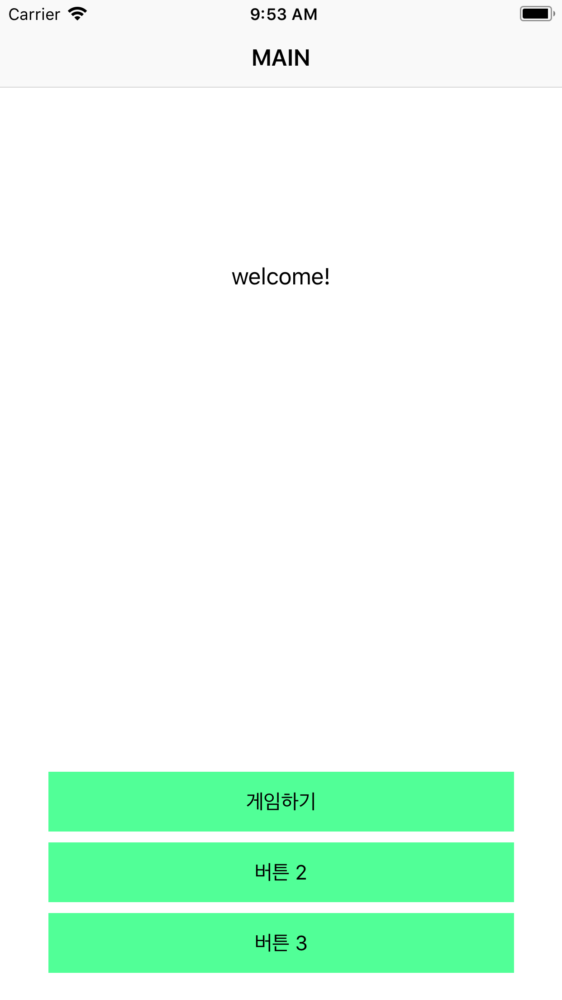
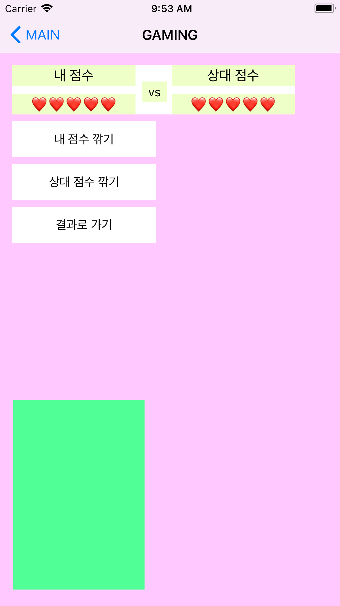

# blinkapp

  

페이지는 총 세 가지로 나뉘며, 각각 Main, Gaming, Result 라고 부릅니다.

### Main
Main은 하나의 레이블과 세 개의 버튼으로 이루어져 있으며, 첫 번째 버튼인 '게임하기' 만 작동합니다.
'게임하기' 버튼을 누르면 1초간 스피너(Activity Indicator)가 돌아가는 뷰가 뜨게 만들었습니다.

### Gaming
Gaming은 점수판을 보여주는 뷰 하나, 기능별 버튼 세 개, 나와 상대방의 이미지를 보여줄 이미지 뷰 두 개로 이루어져 있습니다.
'내 점수 깎기' 버튼이나 '상대 점수 깎기' 버튼을 누르시면 각각에 맞게 레이블이 업데이트 되게 해두었고 '결과로 가기' 버튼을 누르시면 Result 페이지로 넘어갑니다.
핑크색과 청록색 이미지 뷰는 나와 상대방의 이미지를 보여줄 공간이지만 딱히 보여줄 수 있는 기능이 지금은 없기 때문에 배경색만 지정해두었습니다.

### Result
Gaming에서 넘어온 결과값에 따라 나의 점수, 상대방의 점수, 점수 결과에 맞는 승부 결과 (승리, 패배, 무승부) 를 보여줍니다.
